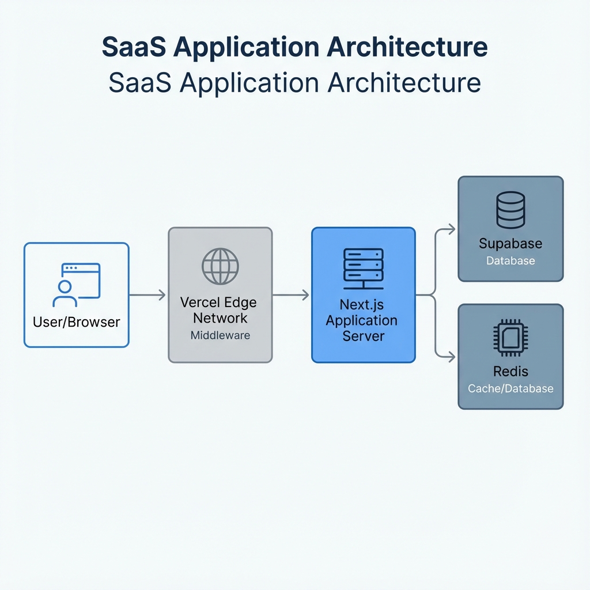

# Project Architecture

This document outlines the high-level architecture of the SaaS Prototype application.

## System Overview

The application is a multi-tenant SaaS platform built with **Next.js 16**, using **Supabase** for the database and **Upstash Redis** for caching. It leverages **NextAuth.js** for authentication and **Vercel** for hosting and edge middleware.

### Key Technologies

-   **Frontend/Framework**: Next.js 16 (App Router, React Server Components)
-   **Language**: TypeScript
-   **Database**: Supabase (PostgreSQL)
-   **Caching/Rate Limiting**: Upstash Redis
-   **Authentication**: NextAuth.js v4 + Supabase Auth
-   **Styling**: Tailwind CSS, Shadcn UI, Framer Motion
-   **Hosting/Edge**: Vercel

## Architectural Diagram



```mermaid
graph TD
    %% Users
    User[User / Browser]
    
    %% Edge Layer
    subgraph Edge_Layer [Edge Layer (Vercel)]
        DNS[DNS / CDN]
        Middleware[Middleware.ts]
    end

    %% Application Layer
    subgraph App_Layer [Application Layer (Next.js)]
        Router[App Router]
        
        subgraph Pages
            Landing[Landing Pages]
            TenantApp[Tenant App /dashboard]
        end
        
        subgraph API
            API_Routes[API Routes]
            Auth_Handler[NextAuth Handler]
        end
    end

    %% Data Layer
    subgraph Data_Layer [Data Infrastructure]
        Supabase[(Supabase PostgreSQL)]
        Redis[(Upstash Redis)]
    end

    %% External Services
    subgraph External [External Services]
        VercelAPI[Vercel API]
        Sentry[Sentry Monitoring]
    end

    %% Connections
    User -->|HTTPS| DNS
    DNS -->|Request| Middleware
    
    Middleware -->|Routing & Tenant Lookup| Redis
    Middleware -->|Rewrite URL| Router
    
    Router -->|Render| Landing
    Router -->|Render| TenantApp
    Router -->|Request| API_Routes
    
    TenantApp -->|Fetch Data| API_Routes
    TenantApp -->|Auth Check| Auth_Handler
    
    API_Routes -->|Query| Supabase
    API_Routes -->|Cache/Rate Limit| Redis
    
    Auth_Handler -->|Verify Session| Supabase
    
    %% External Connections
    API_Routes -->|Manage Domains| VercelAPI
    App_Layer -.->|Error Logs| Sentry
    
    %% Styling
    classDef user fill:#f9f,stroke:#333,stroke-width:2px;
    classDef component fill:#e1f5fe,stroke:#0277bd,stroke-width:2px;
    classDef db fill:#e0f2f1,stroke:#00695c,stroke-width:2px;
    classDef external fill:#fff3e0,stroke:#ef6c00,stroke-width:2px;
    
    class User user;
    class DNS,Middleware,Router,Landing,TenantApp,API_Routes,Auth_Handler component;
    class Supabase,Redis db;
    class VercelAPI,Sentry external;
```

## Core Flows

### 1. Multi-Tenancy Routing
1.  **Incoming Request**: The `middleware.ts` intercepts all requests.
2.  **Hostname Parsing**: It extracts the hostname (e.g., `tenant.app.com` or `custom-domain.com`).
3.  **Tenant Lookup**: Checks Redis/Supabase to identify the tenant associated with the hostname.
4.  **Rewrite**: If a tenant is found, the request is rewritten to `/tenant/[tenantId]/...`.
5.  **Headers**: Tenant context (ID, settings) is injected into request headers for the app to use.

### 2. Authentication
-   Uses **NextAuth.js** with custom credentials or OAuth providers.
-   Sessions are validated against the tenant context to prevent cross-tenant access.
-   Middleware enforces auth on protected routes (e.g., `/dashboard`).

### 3. Data Access
-   **Direct Database Access**: The application uses the Supabase JS client (likely initialized in `src/lib/database/supabase.ts`) to query PostgreSQL directly.
-   **Row Level Security (RLS)**: Supabase RLS policies are crucial for enforcing tenant isolation at the database level.
